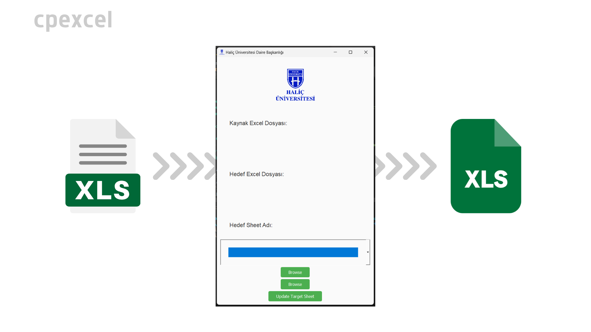

### Excel Copy System

## About The Project

Excel Copy System is a desktop application built using Python and PyQt5. It allows users to filter and transfer data from one Excel file to another while providing options to update specific sheets and highlight duplicate columns. The tool is ideal for automating tasks such as copying filtered rows based on gender and managing Excel sheets with large amounts of data.



Features

- Source & Target Excel File Selection: Select source and target Excel files easily using a graphical interface.
- Filtering: Filter rows from the source file based on a specific word (such as filtering rows by gender).
- Sheet Selection: Choose from available sheets in the target Excel file.
- Duplicate Highlighting: Automatically highlights duplicate columns after copying data.
- Clear & Update Sheets: Clears existing data in the target sheet before appending the new filtered data.

## Getting Started

To get started with the Excel Copy System on your local machine, follow the steps outlined below. This section will guide you through the process of setting up the project locally, installing the necessary dependencies, and running the application.

1. Clone the repository:
   ```sh
   git clone https://github.com/muhkartal/cpexcel
   ```
2. Install the required Python packages:

   ```sh
   pip install -r requirements.txt
   ```

   > If you do not have a `requirements.txt file`, manually install the required libraries with:

   ```sh
   pip install pyqt5 pandas openpyxl
   ```

3. Run the Application
   ```sh
   python main.py
   ```

## Usage

Running the Application
After launching the application, you'll see a graphical interface where you can:

- Select Source Excel File: Choose the Excel file from which data will be filtered.
- Select Target Excel File: Choose the target Excel file to which the filtered data will be written.
- Enter a Filter Word: Specify the word to filter rows (e.g., "Erkek" for filtering by gender).
- Choose a Sheet Name: Select or create a new sheet in the target Excel file.
- Update the Target Sheet: Click the button to copy the filtered data and highlight any duplicate columns.

Follow the on-screen instructions to select files and apply filters.

## Contributing

Contributions are welcome! Please follow these steps to contribute:

1. Fork the repository.
2. Create a new branch `(git checkout -b feature-branch)`.
3. Make your changes and commit them `(git commit -m 'Add feature')`.
4. Push to the branch `(git push origin feature-branch)`.
5. Create a new Pull Request.

Please ensure your code adheres to the style guide and passes all tests.

## License

> This project is licensed under the MIT License. See the LICENSE file for more details.

## Contact

If you encounter any issues, feel free to open an issue or reach out to me [via email](muhammed@kartal.dev).
